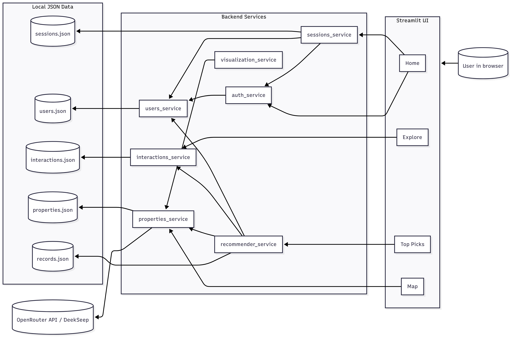

# Summer Home Recommender
This project serves as a 'Summer Home Recommender' by allowing users to create an account and profile with their travel
preferences, browse listings, and be suggested personalized top listings. Features of this project 
include token-based authentication and session tracking, interaction tracking, a map visualization, and collaborative 
filtering. It uses an LLM to generate mock property listings.
## System Design Diagram

This diagram was generated using Mermaid (www.mermaidchart.com)

## Explanation of Recommender Algorithm

The recommender algorithm uses collaborative filtering alongside basic filtering.

For the collaborative filtering segment, the algorithm first builds user affinity (i.e., their preferences). 
To do this, it searches the interactions data to 
find all interactions for the current user. It collects the features and tags (called tokens) of every property involved 
in these interactions. It assign views (viewing a property on the explore page) a weight of 1 and saves (saving a property on 
the explore page) a weight of 3, to reflect the interest users are likely showing through each action. That is, if a 
user viewed a property with the feature 'Hot Tub', the token 'Hot Tub' would appear in the user's affinity with a score of 1.

Based on the user's affinity, the algorithm generates a preference score (pref_score) for each property. This is the 
average of the user's affinity values for any token (features/tags) on the property that also appear in the users 
interaction history (affinity). The pref_score for the property is 0 if there is no overlap or the user has no interaction history.

The algorithm also considers other factors that may influence a user's preferences (basic filtering):
  - Affordability (afford_score): for all properties, compare the property's nightly_price to the user’s budget. Give 
the property full credit (1) when the price is less than or equal to the budget, then reduces as the price rises 
above the budget.
  - Environment (env_score): for all properties, gives a property a score of 1 if the property’s tags contain the 
user’s preferred_env, else 0.

These scores (afford_score, env_score, and pref_score) are combined into a single score and normalized.
Affordability is given the greatest weight, since this is likely to be the most important factor for users. Preferences 
are given a modest weight, especially since having few interactions shouldn't greatly skew the results. 
This parameter could be tuned to be optimal for the user.

All properties are scored as a vector and the top N properties are selected and shown to the user on the UI. 
The percent match of the property is also shown.

Data sources:
- Listings comes from properties_service
- User attributes come from users_service
- Interactions come from /data/interactions.json 
- The top N properties are written to /data/records.json and returned to the frontend.

## Explanation of LLM integration

The project uses an LLM to generate listings. This is useful to **generate a larger quantity of diverse listings than 
could be manually written, to simulate what might be available on a real AirBnb-style app.**

The logic for the LLM integration is owned by properties_service.py

The API key (generated through OpenRouter) is imported from config_private, which is not tracked by git to 
ensure privacy. The service **uses the DeepSeek LLM through OpenRouter's API.** 

The service sends a pre-written prompt in the POST 
request's payload through an OpenRouter URL. The prompt requests 25 properties, each with only the required fields 
(id, location, type, nightly_price, features, tags, capacity, lat, lon). In addition, the prompt asks the model to 
return only JSON, to minimize the amount of filtering needed. The returned properties are written directly to the disk 
(after doing some error handling in case the returned format is not what was expected or nothing was returned). 

The service's api-style function, which the frontend and various other services call, first checks if the properties data already exists. 
If it does, it just returns it. Otherwise, it means this is the first time the app's page has been visited, or some issue 
occurred, so the properties are generated and returned.

## Works Cited

OpenAI. (2025). ChatGPT (Aug 26 version) [Large language model]. https://chat.openai.com

Professor Senderovich, A. (2025). Matching With NumPy Pandas and LLM [Unpublished class code]. 
Rotman School of Management, The University of Toronto.
